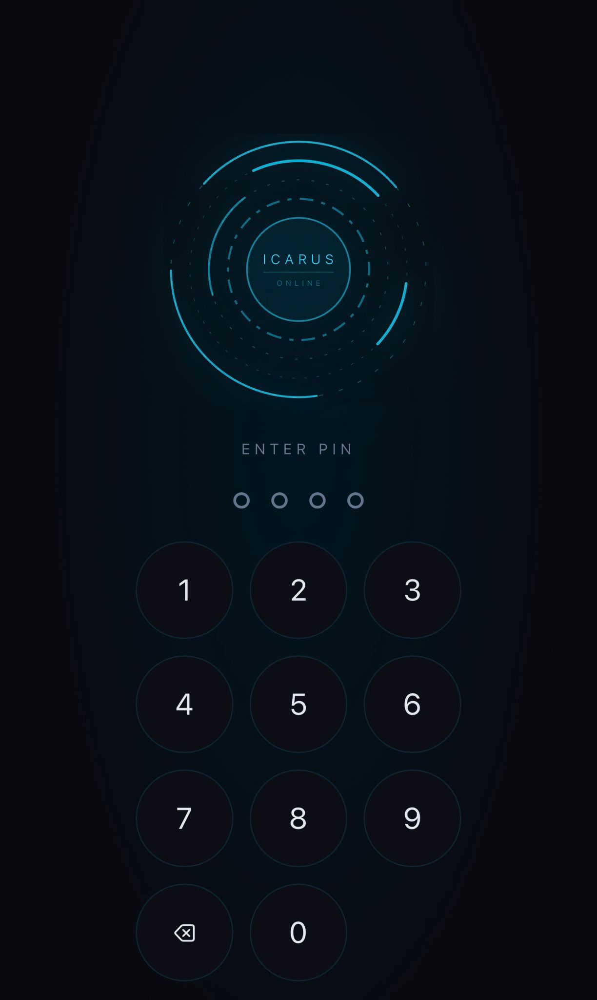
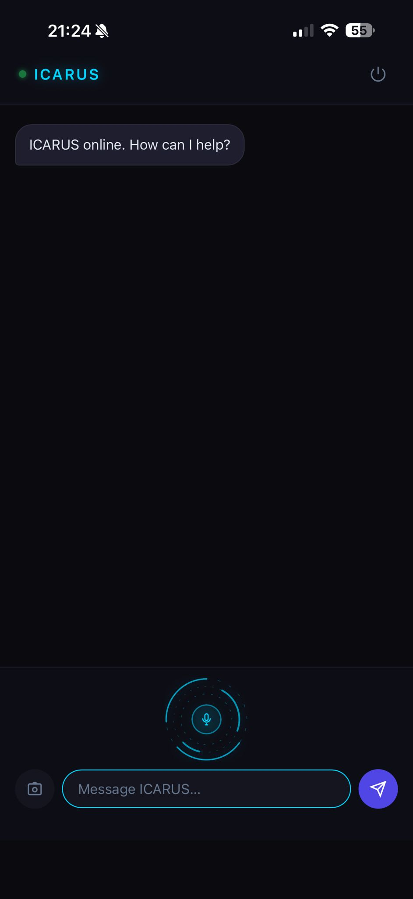

# Icarus AI

Personal AI operating system — Telegram bot + PWA, live at [icarusai.de](https://icarusai.de).

Icarus handles your personal world (calendar, email, tasks, LinkedIn) and orchestrates **Hermes**, an external market intelligence sub-agent that watches ~590 tech suppliers 24/7. Together they form a complete personal operations system: one facing inward, one facing outward.

---

## Live UI

<div align="center">
  
  &nbsp;&nbsp;
  
</div>

> JARVIS-style PWA · PIN auth · voice · photo · installable on mobile

---

## What Icarus Can Do

### Personal Operations
| Capability | How to use |
|---|---|
| Google Calendar | "What's on my calendar this week?" |
| Gmail | "Any urgent emails?" · "Reply to Sarah saying..." |
| GitHub Issues | "Create a task: review supplier contracts" |
| LinkedIn posts | "Draft a post about NVIDIA's new chip" → approve/edit/cancel |
| Shopping list | "Add oat milk" · "What's on my list?" |
| Expense tracking | Log by text or receipt photo |
| Morning briefing | 06:00 Berlin — calendar + email + issues + top Hermes signals |
| Proactive email alerts | Polls every 15 min, AI urgency filter, no spam |
| Web search | "What's the latest on TSMC?" |
| Google Maps | "Coffee near me" · "How long to the office?" |
| Voice messages | Transcribed via Whisper → routed to same pipeline |
| Photo messages | Receipts, screenshots, documents — Claude vision |

### Hermes Market Intelligence
Icarus calls Hermes on demand — no pushing, no personal data shared.

| Tool | Example prompt |
|---|---|
| `hermes_greet` | "Greet Hermes" / "Is Hermes online?" |
| `hermes_query` | "What does Hermes have on TSMC?" |
| `hermes_profile` | "What do we know about Cerebras overall?" |
| `hermes_briefing` | "Give me a market briefing" |
| `hermes_search` | "Any signals about chip export controls?" |
| `hermes_trends` | "What macro themes are emerging this week?" |
| `hermes_crawl` | "Tell Hermes to run a crawl" |
| `hermes_chart` | "Show me a signals chart" |

---

## Architecture

```
You (Telegram / PWA)
         │
         ▼
     ICARUS AI
     (Claude Sonnet 4.6)
         │
         ├── Google Calendar API
         ├── Gmail API
         ├── GitHub API
         ├── LinkedIn API
         ├── Tavily (web search)
         ├── Google Maps API
         ├── Upstash Redis (memory)
         └── HTTP API ──→ HERMES AGENT
                          (market intelligence sub-agent)
```

---

## Tech Stack

| Layer | Technology | Status |
|---|---|---|
| Telegram bot | python-telegram-bot | Live |
| PWA | FastAPI + vanilla JS, PIN auth, installable | Live — icarusai.de |
| AI routing | Claude Sonnet 4.6 (complex) + Haiku 4.5 (fast) | Live |
| Voice | OpenAI Whisper | Live |
| Vision | Claude multimodal | Live |
| Google Calendar | Google Calendar API | Live |
| Gmail | Gmail API — read, search, full body, reply | Live |
| GitHub | GitHub API — issues read + create | Live |
| LinkedIn | LinkedIn API — draft + approval flow | Live |
| Web search | Tavily API | Live |
| Google Maps | Places + Directions API | Live |
| Memory | Upstash Redis (EU West) | Live |
| Market intelligence | Hermes Agent (separate Railway service) | Live |
| Morning briefing | 06:00 Berlin, auto-composed | Live |
| Email alerts | APScheduler poll every 15 min | Live |
| Self-healing | Exception → fix proposal → human review | Live |
| Health monitoring | GitHub Actions cron + Telegram alert | Live |
| HTTPS | Let's Encrypt, auto-renews | Live |
| Deployment | Railway (bot + PWA as separate services) | Live |

---

## Deployment

Two services, one Railway project:

| Service | Entry point | URL |
|---|---|---|
| Telegram bot | `bot/main.py` | (internal) |
| PWA | `pwa_server.py` | [icarusai.de](https://icarusai.de) |

Both auto-deploy on push to `main`.

---

## Environment Variables

```
TELEGRAM_BOT_TOKEN         Telegram bot
TELEGRAM_CHAT_ID           Owner chat ID (auth filter)
ANTHROPIC_API_KEY          Claude Sonnet + Haiku
OPENAI_API_KEY             Whisper transcription
GOOGLE_CREDENTIALS_JSON    Calendar + Gmail OAuth
GITHUB_TOKEN               GitHub API
LINKEDIN_ACCESS_TOKEN      LinkedIn API
TAVILY_API_KEY             Web search
GOOGLE_MAPS_API_KEY        Maps + Places
UPSTASH_REDIS_URL          Redis memory store
UPSTASH_REDIS_TOKEN        Redis memory store
HERMES_URL                 https://hermes-agent-production-114e.up.railway.app
HERMES_API_KEY             Shared secret for Hermes API auth
PORT                       PWA server port (Railway sets this)
```

---

## Project Structure

```
Personal-Assistent/
├── bot/
│   ├── main.py                  Telegram bot — handlers, scheduler, morning brief
│   ├── claude_router.py         Claude tool-use loop — routes all messages
│   ├── skills/
│   │   ├── __init__.py          Tool registry
│   │   ├── hermes.py            8 Hermes tools + HTTP client
│   │   ├── email.py             Gmail reply flow
│   │   └── linkedin.py          LinkedIn post approval flow
│   ├── google_client.py         Calendar + Gmail
│   ├── github_client.py         Issues + roadmap
│   ├── linkedin_client.py       Post + approval
│   ├── audit_log.py             Event log (Redis-backed)
│   └── auto_debug.py            Self-healing error handler
└── pwa_server.py                FastAPI PWA backend
```
